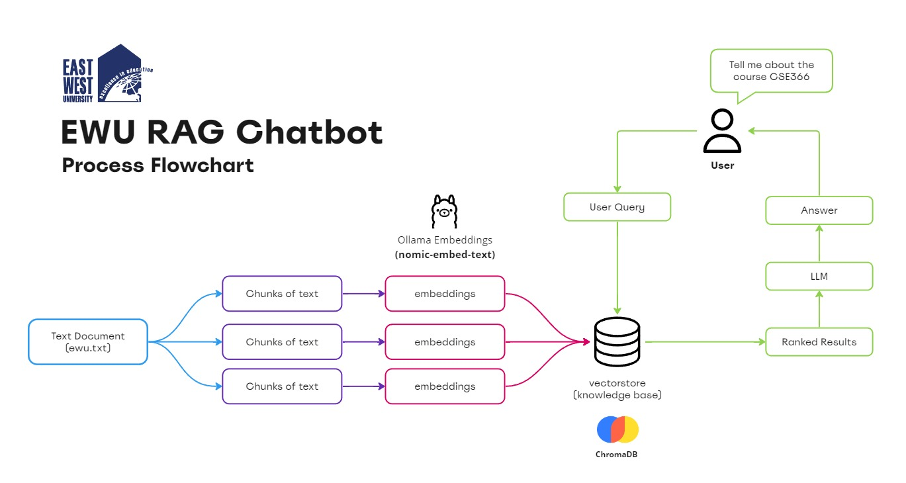
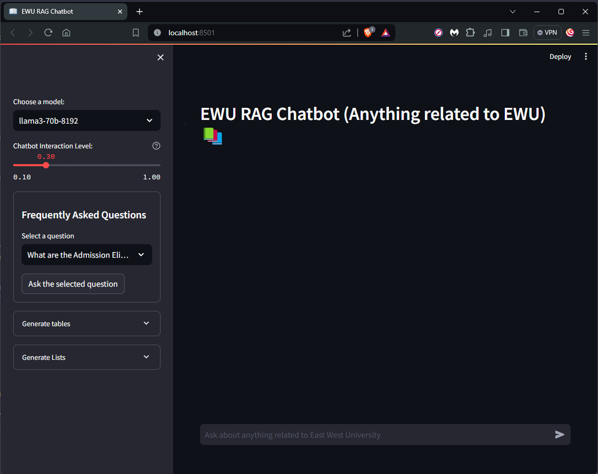

# EWU_RAG_Chatbot 
A RAG (Retrival-Augmented Generation) application on East West University.

# Contributors
| Name                                 | Student ID            | 
| ------------------                   | ----------            |
| Md. Iftekhar Hossain Khan            | 2020-3-60-073         |
| Md. Iftakher Alam                    | 2020-2-60-003         |
| Nourin Nahar Hridy                   | 2021-1-60-102         |
| Hasnain Ahmed                        | 2020-1-60-092         |

# Codeocean's capsule link of the app
**[EWU RAG Chatbot](https://codeocean.com/capsule/7111456/tree)** (Student ID access needed)

## Objective
This project implements the functionalities of using LLMs (Large Language Models) of ***GROQ API Interface*** to answer questions based on its own dataset. 

## Process Flowchart of EWU RAG Chatbot

<br>

# Tools and Libraries used
- **[Ollama]** : For creating embeddings using the open source embedding model **'nomic-embed-text'**
- **[RecursiveCharacterTextSplitter]** : For chunking the document into smaller segment
- **[ChromaDB]** : App's vector database for storing embeddings
- **[GROQ API]**  : Faster inference with the LLMs hosted inside GROQ's interface. 
- **[LangChain]** : Where most of the libraries are used from.
- **[Streamlit]** : App's framework or UI (User Interface)

# Requirements to run the app
- Install the necessary libraries first in a virtual python environment by typing ```pip install -r requirements.txt``` 
- Download Ollama first from [here](https://ollama.com/download)
- After downloading Ollama, start Ollama server by typing: ```ollama serve``` in the terminal
- Pull the Embedding Model by typing ```ollama pull nomic-embed-text```
- Edit the **.env** file by placing your own GROQ API Key there. Get your GROQ API Key from [here](https://console.groq.com/keys). Make sure to create a GROQ account first.
- After downloading the model, start the **app.py** by typing in the terminal ```streamlit run app.py```

Enjoy asking questions related to our East West University.


# Snapshot of the application

    
[GROQ API]:https://wow.groq.com/why-groq/ 
[ChromaDB]:https://docs.trychroma.com/
[LangChain]:https://python.langchain.com/v0.2/docs/introduction/
[RecursiveCharacterTextSplitter]:https://python.langchain.com/v0.1/docs/modules/data_connection/document_transformers/recursive_text_splitter/
[Ollama]:https://ollama.com/library/nomic-embed-text
[Streamlit]:https://streamlit.io/


